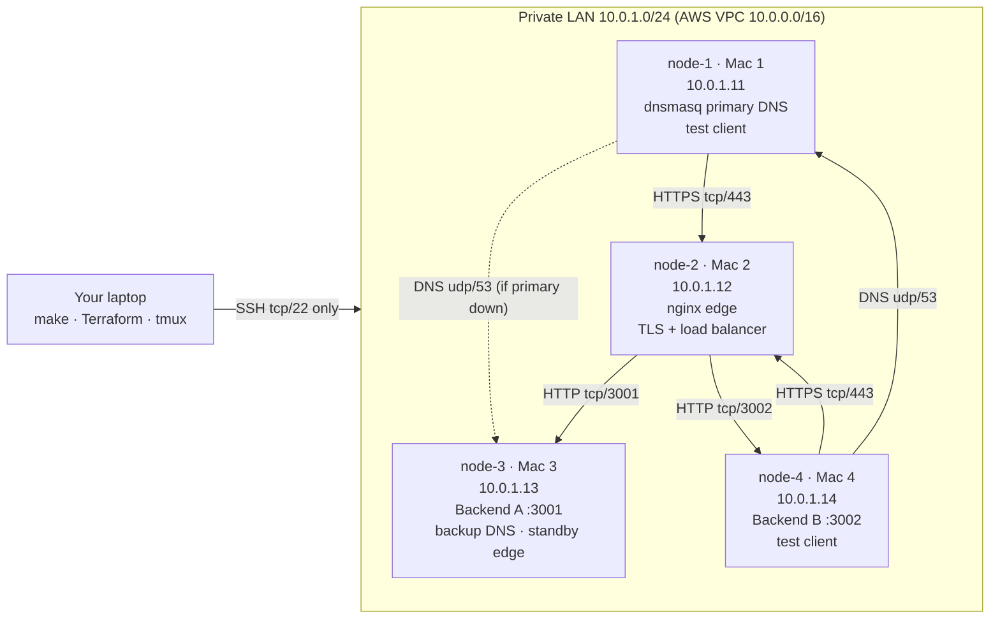

# Architecture

## Topology

The AWS VPC stands in for the lab Wi-Fi:
- One subnet, with fixed private IPs.
- A security group that lets the four machines talk freely to each other (like a flat LAN) and allows only SSH from your public IP from outside.
- Internet access (Internet gateway) is used only for package installation.

## Request flow: `curl https://app.team1.test/api/status` from node-4

1. **Name resolution:** the application asks systemd-resolved (127.0.0.53). It forwards to node-1:53/udp (dnsmasq), which answers `A 10.0.1.12, TTL 30` from its local zone. The answer is cached for 30 s.
2. **TCP:**
   - node-4 opens an ephemeral port (e.g. 51234) to 10.0.1.12:443.
   - The three-way handshake is SYN → SYN-ACK → ACK.
3. **TLS:**
   - ClientHello carries SNI `app.team1.test` and ALPN `h2, http/1.1`.
   - The server replies with ServerHello and its certificate (SAN app/api, signed by the team's private CA).
   - Key exchange (ECDHE) follows, then Finished.
   - The client checks the chain against the CA in its system trust store and the name against the SAN, so no `-k` is needed.
4. **HTTP/2 inside TLS:** `GET /api/status`.
5. **nginx:**
   - Terminates TLS and picks the next upstream (round-robin).
   - Opens plain HTTP to 10.0.1.13:3001 or 10.0.1.14:3002.
   - Adds `X-Forwarded-For` and returns `X-Edge: node-2`.
6. **Backend:** answers JSON with `X-Backend: A|B`. nginx relays it to the client.

When a backend fails, nginx retries the other one (`proxy_next_upstream`) and marks the failed one down for 10 s (`max_fails=1 fail_timeout=10s`). If both are down, the client gets a 502 from the edge.

## Client DNS settings: Phase 1 vs Phase 2

| | Phase 1 (`direct`) | Phase 2 (`stub`) |
|---|---|---|
| `/etc/resolv.conf` | `nameserver 10.0.1.11` | → systemd-resolved 127.0.0.53 |
| What answers `dig app.team1.test` | node-1 directly (`SERVER: 10.0.1.11#53`) | the local cache, which asks 10.0.1.11, then 10.0.1.13 |
| Why | Same as setting the DNS server on a Mac | A caching resolver is needed to show TTL expiry (Ext B, E) and DNS failover (Ext A) |

`cn-resolver apply` sets the right mode from `/etc/cn/cn.env`, and `make converge` runs it.

## OSI / TCP-IP mapping

| Layer | In this project | Evidence |
|---|---|---|
| 7 Application | HTTP/1.1, HTTP/2, DNS, JSON API, Cache-Control/ETag | `curl -v`, dig, access logs |
| 6 Presentation | TLS 1.2/1.3 encryption, X.509 certificates | `cn-capture` (ClientHello … Finished), `openssl s_client` |
| 5 Session | TLS session, HTTP keep-alive, HTTP/2 streams | ALPN in `curl -v` |
| 4 Transport | TCP 443/80/3001/3002, UDP 53, ephemeral ports | TCP handshake in pcap, `ss -lntu` |
| 3 Network | IPv4 10.0.1.0/24, gateway 10.0.1.1, ICMP | `cn-info`, `cn-pingall` |
| 2 Data link | ENA virtual NIC (ens5), MAC addresses | `cn-info` |
| 1 Physical | AWS hypervisor network | – |

## Design decisions

| Decision | Why |
|---|---|
| systemd services, no Kubernetes | The brief is about networking. Every hop is a real IP and port that `ss`, `tcpdump` and Wireshark show directly, with no overlay network or NAT in between. |
| Fixed private IPs | DNS records, configs, captures and viva answers never change between rebuilds. |
| dnsmasq bound to the LAN IP only | Ubuntu's systemd-resolved keeps 127.0.0.53, so there is no port-53 conflict. |
| Private CA instead of a self-signed server certificate | One CA installed on all clients trusts any number of server certificates. Mirrors real PKI. |
| Same body and ETag on both backends for `/api/cached` | A conditional request load-balanced to the other backend still gets 304. |
| Idempotent converge (`make restore`) | One command returns everything to the baseline after any demo or fault. |
| Standby edge + backup DNS on node-3 | Four machines only; the brief allows Mac 3/4 for these roles. |

## Cloud equivalents

| Here | AWS managed equivalent |
|---|---|
| dnsmasq zone team1.test | Route 53 private hosted zone |
| backup DNS, clients list two servers | Route 53 resolver (multi-AZ) |
| nginx edge + TLS termination | Application Load Balancer + ACM certificate, or CloudFront |
| upstream health checks | ALB target group health checks |
| private CA | AWS Private CA |
| iptables isolation (Ext C) | Backend security group allowing only the ALB's security group |
| DNS cutover with TTL (Ext E) | Route 53 failover / weighted records |
| Cache-Control / ETag | CloudFront caching behaviour |

## Remaining single point of failure

The edge (node-2) is the single point of failure: if it dies, every client fails until DNS is changed and caches expire (Extension E shows the TTL delay). Real fixes:
- two active edges behind a floating/virtual IP (keepalived/VRRP), or
- a managed load balancer spread over several availability zones, or
- health-checked DNS failover with a low TTL.
